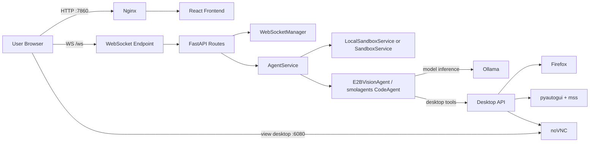
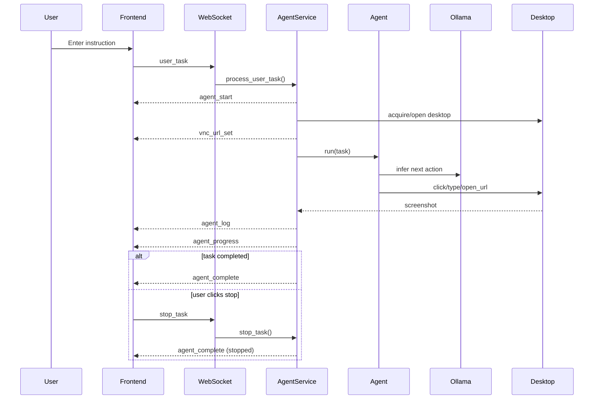

# Architecture

## Overview

`computer-agent-pro` is a local-first fork of the original `smolagents/computer-use-agent`.
It preserves the same high-level idea, but replaces mandatory cloud dependencies with a local runtime built on Ollama, a desktop container, and a React frontend.

The project is composed of 3 runtime services plus supporting scripts:

1. `cua2`
   Main application container. Hosts the FastAPI backend, serves the built React frontend through Nginx, manages WebSocket communication, and coordinates task execution.
2. `desktop`
   Virtual desktop container. Provides a browser, screenshot capture, mouse/keyboard automation, and noVNC streaming.
3. `ollama`
   Local model server. Hosts multimodal models used by the agent, optimized here for 4GB VRAM scenarios.

## Runtime Architecture

```text
Browser UI
  ├─ HTTP -> Nginx -> React app
  └─ WebSocket -> FastAPI backend
                    ├─ AgentService
                    ├─ WebSocketManager
                    ├─ LocalSandboxService / SandboxService
                    └─ smolagents CodeAgent
                              ├─ Ollama model
                              └─ Desktop API
                                        ├─ Firefox
                                        ├─ pyautogui
                                        ├─ mss screenshots
                                        └─ noVNC stream
```

## Runtime Diagram



## Task Flow Diagram



## Service Responsibilities

### `cua2`

Main orchestration service:

- serves the frontend on `http://localhost:7860`
- exposes REST endpoints and WebSocket endpoints
- creates and tracks traces
- runs the agent loop
- sends progress, screenshots, logs, and completion state to the frontend
- manages stop/cancel flow

Main files:

- `cua2-core/src/cua2_core/app.py`
- `cua2-core/src/cua2_core/main.py`
- `cua2-core/src/cua2_core/routes/websocket.py`
- `cua2-core/src/cua2_core/routes/routes.py`
- `cua2-core/src/cua2_core/services/agent_service.py`
- `cua2-core/src/cua2_core/websocket/websocket_manager.py`

### `desktop`

Local GUI automation sandbox:

- runs a virtual Linux desktop
- exposes screenshot and input endpoints
- launches Firefox
- streams the desktop through noVNC

Main files:

- `desktop/api.py`
- `desktop/start.sh`
- `desktop/Dockerfile`

Important endpoints:

- `GET /screenshot`
- `POST /mouse/move`
- `POST /mouse/click`
- `POST /mouse/double_click`
- `POST /mouse/drag`
- `POST /mouse/scroll`
- `POST /keyboard/type`
- `POST /keyboard/press`
- `POST /open_browser`
- `POST /run_command`

### `ollama`

Model serving layer:

- runs `ollama serve`
- downloads configured local models at startup
- exposes model inference on `http://ollama:11434`

Main files:

- `ollama/Dockerfile`
- `ollama/entrypoint.sh`
- `scripts/pull_models.sh`
- `scripts/pull_models.ps1`

## Backend Architecture

### App bootstrap

`cua2-core/src/cua2_core/app.py` is the composition root:

- loads environment variables
- creates `WebSocketManager`
- selects sandbox mode:
  - `LocalSandboxService` when `E2B_API_KEY` is not set
  - `SandboxService` when cloud mode is enabled
- creates `AgentService`
- attaches services to `app.state`

### Routing layer

#### `routes/websocket.py`

Owns the live execution channel:

- accepts WebSocket connections
- emits the initial heartbeat UUID
- receives:
  - `user_task`
  - `stop_task`
- delegates task processing to `AgentService`

#### `routes/routes.py`

Owns HTTP endpoints such as:

- health checks
- available models
- step evaluation updates
- trace data related APIs

### Core execution service

#### `services/agent_service.py`

This is the main orchestration engine. It is responsible for:

- creating active tasks
- storing task-to-websocket relationships
- starting and stopping executions
- maintaining current screenshots
- sending progress events
- handling cleanup and archival

Internal responsibilities:

1. `create_id_and_sandbox()`
   Generates a task UUID and associates it with the current WebSocket.
2. `process_user_task()`
   Initializes the trace and starts async execution.
3. `_agent_processing()`
   Builds callbacks, handles screenshots, converts model output into `AgentStep`, and emits frontend progress.
4. `_agent_runner()`
   Acquires sandbox, constructs the agent, starts execution, manages completion and error states.
5. `stop_task()`
   Marks the task as completed and cancels the execution task.
6. `cleanup_tasks_for_websocket()`
   Releases resources when a client disconnects.

State managed in memory:

- `active_tasks`
- `processing_tasks`
- `task_websockets`
- `last_screenshot`

### Agent abstraction

#### `services/agent_utils/desktop_agent.py`

Defines `E2BVisionAgent`, a `smolagents.CodeAgent` subclass that:

- injects the system prompt
- normalizes coordinates
- registers desktop tools
- captures tool logs for the frontend

Registered tools:

- `click`
- `right_click`
- `double_click`
- `move_mouse`
- `write`
- `press`
- `go_back`
- `drag`
- `scroll`
- `wait`
- `open_url`
- `launch`

### Model selection

#### `services/agent_utils/get_model.py`

Chooses execution mode:

- local mode:
  - uses `LiteLLMModel`
  - points to `OLLAMA_BASE_URL`
- cloud mode:
  - uses `InferenceClientModel`

Default local models:

- `ollama/qwen3-vl:2b`
- `ollama/llava`
- `ollama/llava:7b`
- `ollama/qwen3-vl:4b`

### Sandbox abstraction

#### `services/local_sandbox_service.py`

Local implementation used when no API keys are configured:

- provides a shared local desktop
- keeps sandbox lifecycle simple
- exposes the same shape expected by the agent layer

#### `services/local_desktop.py`

Adapter that translates agent actions into Desktop API calls:

- screenshot capture
- mouse movement/clicks
- keyboard typing/shortcuts
- browser opening
- command execution

#### `services/sandbox_service.py`

Cloud sandbox implementation preserved for optional E2B mode.

### WebSocket event layer

#### `websocket/websocket_manager.py`

Serializes and emits frontend events:

- `agent_start`
- `agent_progress`
- `agent_complete`
- `agent_error`
- `agent_log`
- `vnc_url_set`
- `vnc_url_unset`
- `heartbeat`

### Data models

#### `models/models.py`

Defines the shared contracts used by the backend and frontend:

- `AgentTrace`
- `AgentStep`
- `AgentAction`
- `AgentTraceMetadata`
- `FinalStep`
- WebSocket event payload models

### Persistence and archival

The app writes trace data to the local `data/` directory.

Each trace folder stores:

- task metadata
- step data
- screenshots

Archival support remains in the project:

- `services/archival_service.py`

In local mode this is mostly passive unless cloud archival is configured.

## Frontend Architecture

### Stack

- React
- Vite
- TypeScript
- Zustand
- Material UI
- React Router

### Frontend entry points

- `cua2-front/src/main.tsx`
- `cua2-front/src/App.tsx`

`App.tsx` initializes the persistent WebSocket connection and routing:

- `/`
  Welcome screen
- `/task`
  Live execution screen

### Global state

#### `cua2-front/src/stores/agentStore.ts`

Zustand store that holds:

- current trace
- heartbeat `traceId`
- execution logs
- processing state
- connection state
- selected model
- VNC URL
- current error
- selected step
- final step
- theme mode

Key actions:

- `setTrace`
- `setTraceId`
- `setAgentStartTrace`
- `updateTraceWithStep`
- `completeTrace`
- `setError`
- `addExecutionLog`
- `clearExecutionLogs`
- `resetAgent`

### WebSocket integration

#### `cua2-front/src/hooks/useAgentWebSocket.ts`

Maps backend events into UI state updates:

- initializes the socket
- handles `heartbeat`
- sends `user_task`
- sends `stop_task`
- updates trace, logs, VNC URL, and final state

### Main UI screens

#### `pages/Welcome.tsx`

Responsible for:

- collecting the instruction
- selecting the model
- starting a new task
- navigating to the task screen

#### `pages/Task.tsx`

Main task execution layout:

- top header/status
- live desktop viewer
- timeline summary
- execution log
- step cards

### Main UI components

#### `components/Header.tsx`

Displays:

- task title
- running/stopped/completed state
- elapsed time
- token usage
- step counts
- stop button

#### `components/sandbox/SandboxViewer.tsx`

Shows:

- VNC session
- current screenshot/selected step image
- completion state

#### `components/timeline/Timeline.tsx`

Displays compact aggregate progress:

- duration
- token totals
- number of steps
- completion metadata

#### `components/ExecutionLog.tsx`

Displays:

- task start
- connection progress
- tool execution logs
- thoughts
- actions
- completion/errors

#### `components/steps/*`

Step visualization layer:

- `StepsList.tsx`
- `StepCard.tsx`
- `ThinkingStepCard.tsx`
- `ConnectionStepCard.tsx`
- `FinalStepCard.tsx`

## End-to-End Execution Flow

### 1. User starts a task

Frontend flow:

1. user enters instruction on `/`
2. frontend sends `user_task` through WebSocket
3. frontend navigates to `/task`

Backend flow:

1. WebSocket endpoint receives the trace
2. `AgentService.process_user_task()` registers the task
3. async execution starts

### 2. Agent bootstraps

1. backend sends `agent_start`
2. backend acquires local or cloud sandbox
3. backend instantiates `E2BVisionAgent`
4. backend sends `vnc_url_set`
5. initial screenshot is captured

### 3. Agent executes steps

For each step:

1. model reasons over the screenshot and prompt
2. tool calls are parsed
3. desktop actions run through `LocalDesktop`
4. screenshot is captured again
5. metadata and step are stored
6. backend sends:
   - `agent_log`
   - `agent_progress`

### 4. Frontend updates live

1. Zustand store updates current trace
2. `SandboxViewer` refreshes
3. `StepsList` appends the new step
4. `ExecutionLog` shows thoughts/actions/logs
5. `Header` updates duration and token counters

### 5. Completion or stop

When done:

- backend sends `agent_complete`
- frontend marks final state
- VNC URL is unset
- trace is saved locally

When user clicks stop:

- frontend sends `stop_task`
- backend marks the task as completed
- execution task is cancelled
- final state becomes `stopped`

## Deployment Structure

### Local mode

Default path:

- frontend + backend inside `cua2`
- desktop in `desktop`
- model serving in `ollama`

No external API keys required.

### Cloud mode

Optional path:

- `HF_TOKEN`
- `E2B_API_KEY`

This switches model inference and sandbox execution back toward the original cloud-based architecture.

## Repository Structure

```text
computer-agent-pro/
├── cua2-core/
│   ├── src/cua2_core/
│   │   ├── app.py
│   │   ├── main.py
│   │   ├── models/
│   │   ├── routes/
│   │   ├── services/
│   │   │   ├── agent_service.py
│   │   │   ├── local_desktop.py
│   │   │   ├── local_sandbox_service.py
│   │   │   └── agent_utils/
│   │   └── websocket/
│   └── tests/
├── cua2-front/
│   ├── src/
│   │   ├── components/
│   │   ├── hooks/
│   │   ├── pages/
│   │   ├── services/
│   │   ├── stores/
│   │   └── types/
├── desktop/
├── ollama/
├── scripts/
├── docker-compose.yml
├── Dockerfile
├── nginx.conf
├── README.md
└── ARCHITECTURE.md
```

## Key Design Decisions

1. Local-first execution
   Removes mandatory HF and E2B dependencies.
2. Shared desktop abstraction
   Keeps the original sandbox contract while enabling local execution.
3. Persistent WebSocket session
   Simplifies live UI updates and stop behavior.
4. Trace-first model
   Every execution is represented as a trace with step history and metadata.
5. Containerized runtime
   Keeps browser automation, backend, and inference isolated and reproducible.

## Current Limitations

1. The task page depends on in-memory trace state and is not yet a fully reloadable deep-link page.
2. Local desktop mode uses a shared desktop rather than isolated per-task sandboxes.
3. The local mode is optimized for practical execution, not strict multi-tenant security.
4. Some original cloud-oriented services remain in the codebase for compatibility, even when not used locally.
